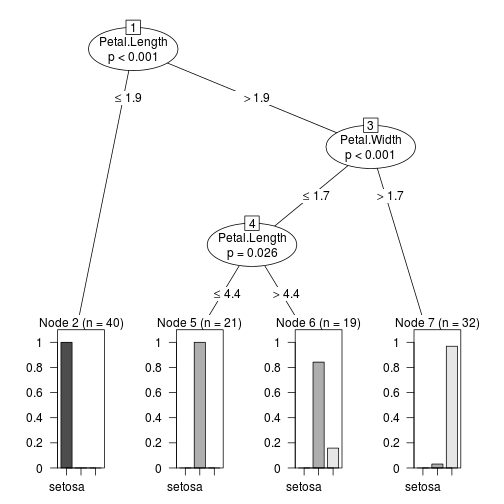

Exemplo de uso de algoritmos indutores de árvore de decisão
===========================================================

Este relatório exemplifica o uso dos pacotes **party** e **RWeka** em problemas de classificação.

As referências utilizadas para a construção deste relatório foram: [http://cran.r-project.org/web/packages/RWeka/RWeka.pdf](http://cran.r-project.org/web/packages/RWeka/RWeka.pdf), [http://cran.r-project.org/doc/contrib/Zhao_R_and_data_mining.pdf](http://cran.r-project.org/doc/contrib/Zhao_R_and_data_mining.pdf) e [http://cran.r-project.org/web/packages/party/party.pdf](http://cran.r-project.org/web/packages/party/party.pdf).

Acessando o dataset e criando os conjuntos de treinamento (70% das observações) e testes (30% das observações):


```r
set.seed(1234)
data(iris)
ind <- sample(2, nrow(iris), replace = TRUE, prob = c(0.7, 0.3))
trainData <- iris[ind == 1, ]
testData <- iris[ind == 2, ]
```


Faz a carga da biblioteca **party** e constrói a árvore de decisão usando o _ctree_:


```r
library(party)
myFormula <- Species ~ Sepal.Length + Sepal.Width + Petal.Length + Petal.Width
iris_ctree <- ctree(myFormula, data = trainData)
```


Constrói a matriz de confusão usando o conjunto de treinamento:


```r
table(predict(iris_ctree), trainData$Species)
```

```
##             
##              setosa versicolor virginica
##   setosa         40          0         0
##   versicolor      0         37         3
##   virginica       0          1        31
```


Visualizando a árvore de decisão gerada:


```r
print(iris_ctree)
```

```
## 
## 	 Conditional inference tree with 4 terminal nodes
## 
## Response:  Species 
## Inputs:  Sepal.Length, Sepal.Width, Petal.Length, Petal.Width 
## Number of observations:  112 
## 
## 1) Petal.Length <= 1.9; criterion = 1, statistic = 104.643
##   2)*  weights = 40 
## 1) Petal.Length > 1.9
##   3) Petal.Width <= 1.7; criterion = 1, statistic = 48.939
##     4) Petal.Length <= 4.4; criterion = 0.974, statistic = 7.397
##       5)*  weights = 21 
##     4) Petal.Length > 4.4
##       6)*  weights = 19 
##   3) Petal.Width > 1.7
##     7)*  weights = 32
```

```r
plot(iris_ctree)
```

 

```r
plot(iris_ctree, type = "simple")
```

 


Gerando a matriz de confusão usando o conjunto de treinamento:


```r
testPred <- predict(iris_ctree, newdata = testData)
table(testPred, testData$Species)
```

```
##             
## testPred     setosa versicolor virginica
##   setosa         10          0         0
##   versicolor      0         12         2
##   virginica       0          0        14
```


Fazendo _cross-validation_
=========================================================

A biblioteca _ipred_ possui funções que são específicas para a etapa de _cross-validation_.


```r
library(ipred)
```


Executando um _10-fold cross-validation_:


```r
set.seed(1234)
error <- numeric(10)
for (i in 1:10) error[i] <- errorest(Species ~ ., data = iris, model = ctree)$error
error
```

```
##  [1] 0.06000 0.06667 0.06667 0.06000 0.06667 0.06667 0.06667 0.06000
##  [9] 0.08000 0.06000
```

```r
summary(error)
```

```
##    Min. 1st Qu.  Median    Mean 3rd Qu.    Max. 
##  0.0600  0.0600  0.0667  0.0653  0.0667  0.0800
```


Uso do algoritmo J48
=========================================================

Importando a biblioteca e criando o modelo:


```r
library(RWeka)
iris_j48 <- J48(myFormula, data = trainData)
```


Obtendo a matriz de confusão:


```r
table(predict(iris_j48), trainData$Species)
```

```
##             
##              setosa versicolor virginica
##   setosa         40          0         0
##   versicolor      0         36         1
##   virginica       0          2        33
```

```r
pred <- predict(iris_j48)
```


Imprindo a árvore gerada:


```r
print(iris_j48)
```

```
## J48 pruned tree
## ------------------
## 
## Petal.Width <= 0.6: setosa (40.0)
## Petal.Width > 0.6
## |   Petal.Width <= 1.7
## |   |   Petal.Length <= 5: versicolor (37.0/1.0)
## |   |   Petal.Length > 5: virginica (3.0/1.0)
## |   Petal.Width > 1.7: virginica (32.0/1.0)
## 
## Number of Leaves  : 	4
## 
## Size of the tree : 	7
```

```r
plot(iris_j48)
```

 


Validando o modelo no conjunto de treinamento:


```r
testPred <- predict(iris_j48, newdata = testData)
table(testPred, testData$Species)
```

```
##             
## testPred     setosa versicolor virginica
##   setosa         10          0         0
##   versicolor      0         12         1
##   virginica       0          0        15
```

