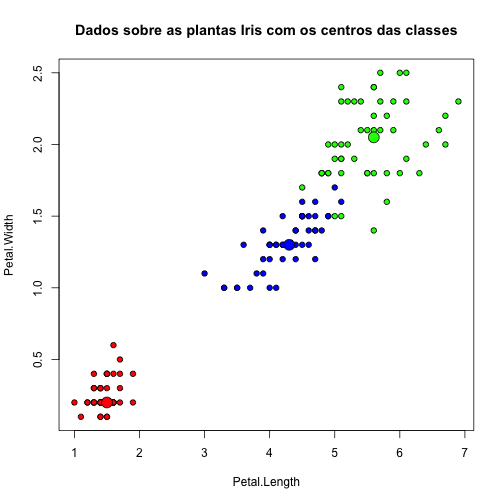
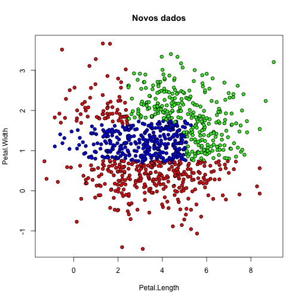

Exemplo de uso do algoritmo random forest
=============================================

As principais referências para a produção deste exemplo foram [http://cran.r-project.org/doc/contrib/Zhao_R_and_data_mining.pdf](http://cran.r-project.org/doc/contrib/Zhao_R_and_data_mining.pdf), [http://cran.r-project.org/web/packages/randomForest/randomForest.pdf] (http://cran.r-project.org/web/packages/randomForest/randomForest.pdf) e [ftp://131.252.97.79/Transfer/temp_treg/WFRE_Articles/Liaw_02_Classification%20and%20regression%20by%20randomForest.pdf](ftp://131.252.97.79/Transfer/temp_treg/WFRE_Articles/Liaw_02_Classification%20and%20regression%20by%20randomForest.pdf)

Carga da biblioteca e do conjunto de dados utilizados no exemplo:


```r
library(randomForest)
data(iris)
```


```r
head(iris)
```

```
##   Sepal.Length Sepal.Width Petal.Length Petal.Width Species
## 1          5.1         3.5          1.4         0.2  setosa
## 2          4.9         3.0          1.4         0.2  setosa
## 3          4.7         3.2          1.3         0.2  setosa
## 4          4.6         3.1          1.5         0.2  setosa
## 5          5.0         3.6          1.4         0.2  setosa
## 6          5.4         3.9          1.7         0.4  setosa
```


Etapa de treinamento:


```r
forestIris <- randomForest(Species ~ Petal.Width + Petal.Length, data = iris, 
    prox = TRUE)
forestIris
```

```
## 
## Call:
##  randomForest(formula = Species ~ Petal.Width + Petal.Length,      data = iris, prox = TRUE) 
##                Type of random forest: classification
##                      Number of trees: 500
## No. of variables tried at each split: 1
## 
##         OOB estimate of  error rate: 3.33%
## Confusion matrix:
##            setosa versicolor virginica class.error
## setosa         50          0         0        0.00
## versicolor      0         47         3        0.06
## virginica       0          2        48        0.04
```


Recuperando uma das árvores geradas:


```r
getTree(forestIris, k = 2)
```

```
##    left daughter right daughter split var split point status prediction
## 1              2              3         1        0.80      1          0
## 2              0              0         0        0.00     -1          1
## 3              4              5         2        4.75      1          0
## 4              6              7         1        1.65      1          0
## 5              8              9         1        1.75      1          0
## 6              0              0         0        0.00     -1          2
## 7              0              0         0        0.00     -1          3
## 8             10             11         2        4.95      1          0
## 9              0              0         0        0.00     -1          3
## 10             0              0         0        0.00     -1          2
## 11            12             13         2        5.35      1          0
## 12            14             15         2        5.05      1          0
## 13             0              0         0        0.00     -1          3
## 14             0              0         0        0.00     -1          3
## 15             0              0         0        0.00     -1          2
```


Gerando uma matriz de confusão:


```r
table(predict(forestIris), iris$Species)
```

```
##             
##              setosa versicolor virginica
##   setosa         50          0         0
##   versicolor      0         47         2
##   virginica       0          3        48
```

```r
prop.table(table(predict(forestIris), iris$Species))
```

```
##             
##               setosa versicolor virginica
##   setosa     0.33333    0.00000   0.00000
##   versicolor 0.00000    0.31333   0.01333
##   virginica  0.00000    0.02000   0.32000
```


Identificação dos centros das classes:


```r
iris.p <- classCenter(iris[, c(3, 4)], iris$Species, forestIris$prox)
plot(iris[, 3], iris[, 4], pch = 21, xlab = names(iris)[3], ylab = names(iris)[4], 
    bg = c("red", "blue", "green")[as.numeric(factor(iris$Species))], main = "Dados sobre as plantas Iris com os centros das classes")
points(iris.p[, 1], iris.p[, 2], pch = 21, cex = 2, bg = c("red", "blue", "green"))
```

 


Combinando vários modelos:


```r
forestIris1 <- randomForest(Species ~ Petal.Width + Petal.Length, data = iris, 
    prox = TRUE, ntree = 50)
forestIris2 <- randomForest(Species ~ Petal.Width + Petal.Length, data = iris, 
    prox = TRUE, ntree = 50)
forestIris3 <- randomForest(Species ~ Petal.Width + Petal.Length, data = iris, 
    prox = TRUE, ntree = 50)
forestIris1
```

```
## 
## Call:
##  randomForest(formula = Species ~ Petal.Width + Petal.Length,      data = iris, prox = TRUE, ntree = 50) 
##                Type of random forest: classification
##                      Number of trees: 50
## No. of variables tried at each split: 1
## 
##         OOB estimate of  error rate: 4.67%
## Confusion matrix:
##            setosa versicolor virginica class.error
## setosa         50          0         0        0.00
## versicolor      0         47         3        0.06
## virginica       0          4        46        0.08
```

```r
forestIris2
```

```
## 
## Call:
##  randomForest(formula = Species ~ Petal.Width + Petal.Length,      data = iris, prox = TRUE, ntree = 50) 
##                Type of random forest: classification
##                      Number of trees: 50
## No. of variables tried at each split: 1
## 
##         OOB estimate of  error rate: 4%
## Confusion matrix:
##            setosa versicolor virginica class.error
## setosa         50          0         0        0.00
## versicolor      0         47         3        0.06
## virginica       0          3        47        0.06
```

```r
forestIris3
```

```
## 
## Call:
##  randomForest(formula = Species ~ Petal.Width + Petal.Length,      data = iris, prox = TRUE, ntree = 50) 
##                Type of random forest: classification
##                      Number of trees: 50
## No. of variables tried at each split: 1
## 
##         OOB estimate of  error rate: 5.33%
## Confusion matrix:
##            setosa versicolor virginica class.error
## setosa         50          0         0        0.00
## versicolor      0         47         3        0.06
## virginica       0          5        45        0.10
```

```r
model <- combine(forestIris1, forestIris2, forestIris3)
model
```

```
## 
## Call:
##  randomForest(formula = Species ~ Petal.Width + Petal.Length,      data = iris, prox = TRUE, ntree = 50) 
##                Type of random forest: classification
##                      Number of trees: 150
## No. of variables tried at each split: 1
```


Matriz de confusão para o novo modelo:


```r
table(predict(model, iris), iris$Species)
```

```
##             
##              setosa versicolor virginica
##   setosa         50          0         0
##   versicolor      0         49         1
##   virginica       0          1        49
```


Predizer as classes para novos objetos:


```r
newdata <- data.frame(Sepal.Length <- rnorm(1000, mean(iris$Sepal.Length), sd(iris$Sepal.Length)), 
    Sepal.Width <- rnorm(1000, mean(iris$Sepal.Width), sd(iris$Sepal.Width)), 
    Petal.Width <- rnorm(1000, mean(iris$Petal.Width), sd(iris$Petal.Width)), 
    Petal.Length <- rnorm(1000, mean(iris$Petal.Length), sd(iris$Petal.Length)))

pred <- predict(model, newdata)
```


Mostrando visualmente que o _random forest_ é capaz de separar conjunto de dados que não são separáveis linearmente:


```r
plot(newdata[, 4], newdata[, 3], pch = 21, xlab = "Petal.Length", ylab = "Petal.Width", 
    bg = c("red", "blue", "green")[as.numeric(pred)], main = "Novos dados")
```

 


